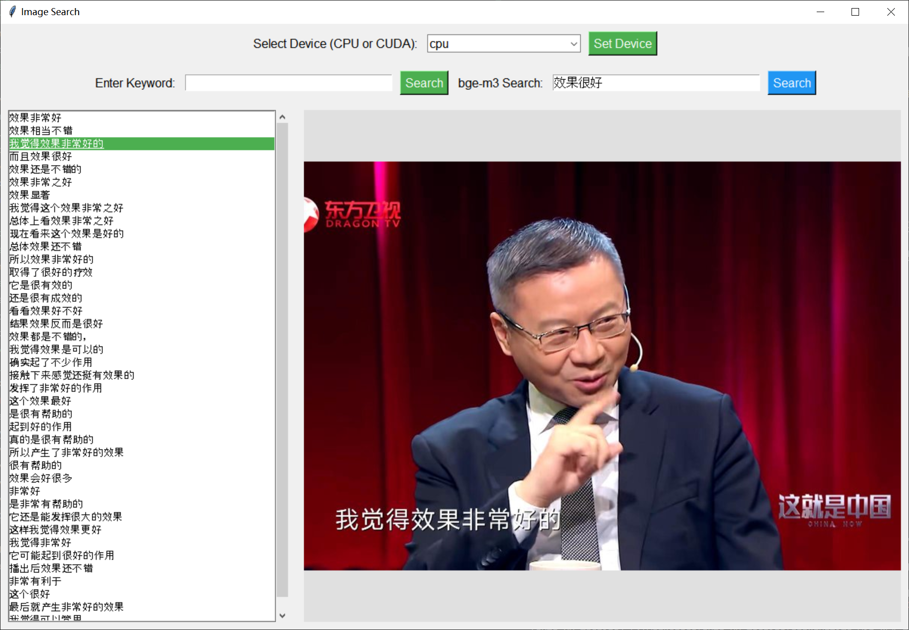

# Auto-vv-Machine

张维为教授总能一针见血地指出社会的问题，学养深厚，深受大家喜爱。我整理了张教授的诸多语录，可以使用关键词或者BGE-M3模型检索，帮助大家日常学习。

# 更新
- 2025-3-13: 用户@HelloCard 人工校正了570个条目, 已经在百度网盘中更新。更正了关键词搜索（普通模式）下大写字母无法检索的BUG。

          添加了API的形式，可以直接调用API进行BGE-M3检索（来自硅基流动），上下文搜索在有API_KEY的情况下会调用Qwen2.5-7B回复，同时可以自由设定回复风格（默认为讽刺）。以上两个模型在硅基流动均免费。

          API_KEY可以在cloud.siliconflow.cn中注册获取。为了避免每次都需要填写，可以在config.json中填充，自动读取。

          search_api.py是简略版，不需要安装pytorch。百度网盘也已经上传了search_api.exe，可以快速运行。

- 2025-3-11: 线上关键词搜索网站, vv.whcpumpkin.icu, 资金有限，可能比较慢。不支持AI模式。
- 2025-3-10: 添加了上下文搜索，输入上文，搜索最佳回复上文的VV图片。添加了右键复制图片功能。
- 2025-3-5: 重新从265期视频中，根据whisper定位有字幕帧，然后提取该帧并用GOT-OCR2_0 进行OCR识别，并进行字幕去重、去掉没有张教授出现的图片，一共得到11.7万张无重复的、包含张维为教授人脸的图片。称为“张教授表情包库2.0”。
并且普通版本不再需要下载pytorch




## 资源下载
下载地址：

1.0版 百度网盘：https://pan.baidu.com/s/1oR9d-Yx_j7U013C6eaKCsg?pwd=wkgj 
(1.0版本不再建议下载，请使用2.0版本)

2.0版 百度网盘：https://pan.baidu.com/s/126L5xCbZHJnqZh3M_MW1QA?pwd=496a

(onlyvv.zip是onlyvv的压缩包，下载之后解压)

## 目录结构
把网盘中的内容按以下方式组织
```
├── README.md
├── search.py
├── requirements.txt
├── bge-m3
├── cached_file.npy
├── onlyvv-result-no-repeat.json
├── demo.png
└── onlyvv
     ├── 001
          └──frame_0002.jpg
     ├── 002
          └──frame_0010.jpg
     ├── 002
     ├── 003
```


## 环境安装
### 普通模式
```

conda create -n auto-vv-machine python=3.10

conda activate auto-vv-machine


pip install -r requirements.txt
```

### API模式
```
conda create -n auto-vv-machine python=3.10

conda activate auto-vv-machine

pip install -r requirements.txt
```
API模式必须填充API_KEY，请在config.json中填充或者在UI界面中保存。

### AI 模式
```
在普通模式基础上安装：

(cuda版本和cpu版本请根据硬件选择其中一个)
cuda版本：
pip install torch==2.3.0 --index-url https://download.pytorch.org/whl/cu118
cpu版本：
pip install torch==2.3.0
pip install -U FlagEmbedding
git clone https://huggingface.co/BAAI/bge-m3 // 这一步不进行会自动联网下载，注意你的网络情况。如果网络情况不太好，可以从百度网盘中下载模型文件放入目录下。
```

注意：AI模式可以不安装，仅使用关键词搜索。如果启用AI模式+CUDA，建议空闲显存至少为6G；如果启用AI模式+CPU，建议空闲内存至少为8G

## 使用

```
python search.py
```


可以在最上方设置设备为cpu或者cuda:0，选择之后点一下``Set device``按钮。

每次运行后，第一次用AI检索会有点慢，是因为模型还在导入。

